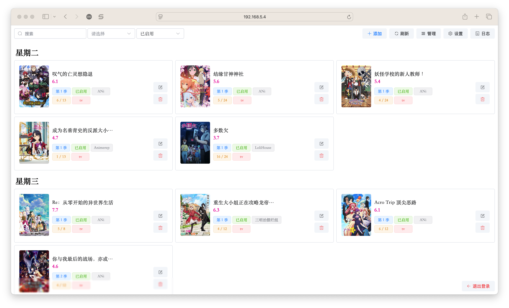

# Docker部署

<div>


[](https://hub.docker.com/r/wushuo894/ani-rss)
[](http://qm.qq.com/cgi-bin/qm/qr?_wv=1027&k=_EKAkxs6Ld4fWcMNAbUQzcp4tv20vjVH&authKey=KG3GAsZfKQosbAWkks%2FbEj0LCGwxoeLJ3DTU0loHkGdHLqHYgJNv3%2BmSERmYt47b&noverify=0&group_code=171563627)
[](https://github.com/wushuo894/ani-rss)
</div>

[设置解读](/config/download)



默认 用户名: admin 密码: admin

| 参数     | 作用       | 默认值           |
|--------|----------|---------------|
| PORT   | 端口号      | 7789          |
| CONFIG | 配置文件存放位置 | /config       |
| TZ     | 时区       | Asia/Shanghai |

::: warning
如果需要开启 文件已下载自动跳过 功能 请确保 qBittorrent 与本程序 docker 映射挂载路径一致
:::

## 视频教程

[阿里云盘](https://www.alipan.com/s/eqt2XLZJThu)

<div style="overflow-x: auto;">
<iframe 
width="560" 
height="315" 
src="https://www.youtube.com/embed/y9-mgvnSnxs?si=CCz_58LaZu3mbpr5" 
title="YouTube video player" 
frameborder="0" 
allow="accelerometer; autoplay; clipboard-write; encrypted-media; gyroscope; picture-in-picture; web-share" 
referrerpolicy="strict-origin-when-cross-origin" 
allowfullscreen>
</iframe>
</div>

## Docker 部署

```bash
docker run -d \
--name ani-rss \
-v /volume1/docker/ani-rss/config:/config \
-v /volume2/Media:/Media \
-p 7789:7789 \
-e PORT="7789" \
-e CONFIG="/config" \
-e TZ=Asia/Shanghai \
--restart always \
wushuo894/ani-rss
```

## Docker Compose 部署

创建docker-compose.yml文件，内容如下

```yaml
version: "3"
services:
  ani-rss:
    container_name: ani-rss
    volumes:
      - /volume1/docker/ani-rss/config:/config
      - /volume2/Media:/Media
    ports:
      - 7789:7789
    environment:
      - PORT=7789
      - CONFIG=/config
      - TZ=Asia/Shanghai
    restart: always
    image: wushuo894/ani-rss
```

启动容器

```bash
docker compose up -d
```

::: info
如需对Docker内的`ani-rss`设置本机跳过身份验证，请留意登录日志内的IP信息。
:::

## 附带qBittorrent的Docker Compose 部署

```yaml
version: "3"
services:
  qBittorrent:
    image: linuxserver/qbittorrent
    container_name: qBittorrent
    ports:
      - 8080:8080 #qb端口
    environment:
      - PUID=1000
      - PGID=1000
      - WEBUIPORT=8080
      - TZ=Asia/Shanghai
    volumes:
      - /volume1/docker/qb:/config
      - /volume2/downloads:/downloads
      - /volume2/Media:/Media #番剧挂载路径两侧须一致
    restart: unless-stopped
    networks:
      - ani-rss
  ani-rss:
    image: wushuo894/ani-rss
    container_name: ani-rss
    ports:
      - 7789:7789
    environment:
      - PORT=7789
      - CONFIG=/config
      - TZ=Asia/Shanghai
    volumes:
      - /volume1/docker/ani-rss:/config
      - /volume2/Media:/Media #番剧挂载路径两侧须一致
    restart: unless-stopped
    networks:
      - ani-rss
```

如果使用了如上配置，请将[下载设置](../config/download#下载工具)修改为如下配置：

| 条目   | 内容                      |
|------|-------------------------|
| 下载工具 | qBittorrent             |
| 地址   | http://qBittorrent:8080 |
| 用户名  | admin                   |
| 密码   |                         |
| 保存位置 | /volume2/Media          |

::: info
初次启动时 `qBittorrent` 会为 `admin` 用户生成一个随机密码，请查看日志获取初始密码。
:::

::: warning
下载设置的地址url须与容器服务配置对应。如果采用了如下设置，请将地址改为`http://qb:8000`

```md
services:
......
qb:
image: linuxserver/qbittorrent
container_name: qBittorrent
ports:
# 外部端口:内部端口
- 8000:8080
environment:
- WEBUIPORT=8080
......
```

:::
