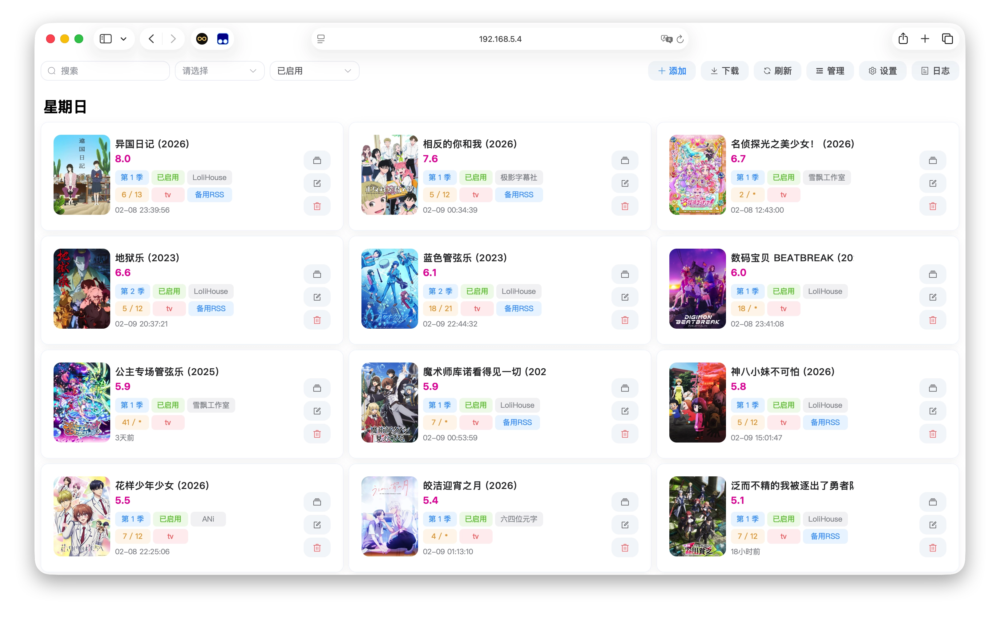
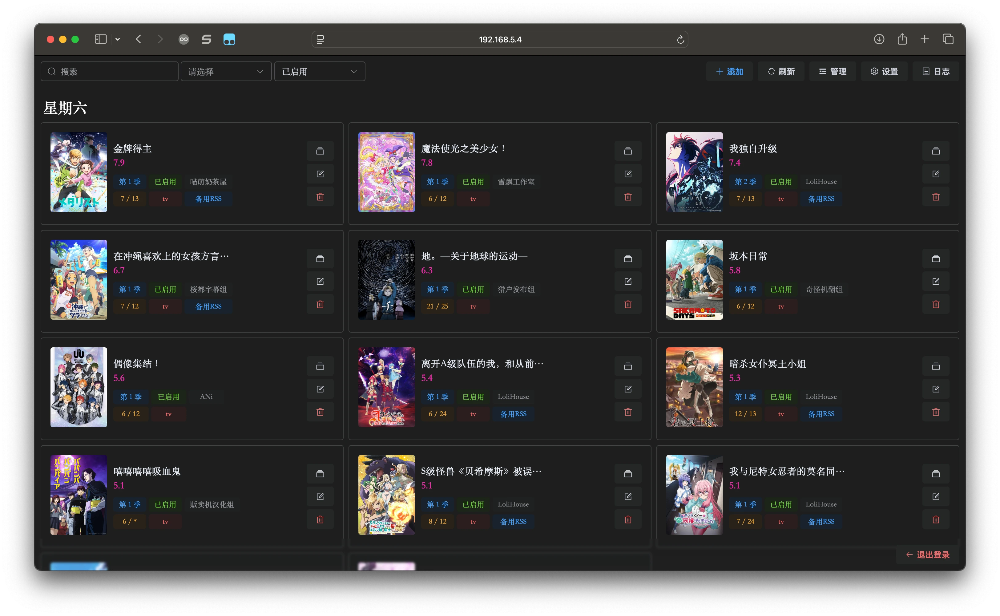
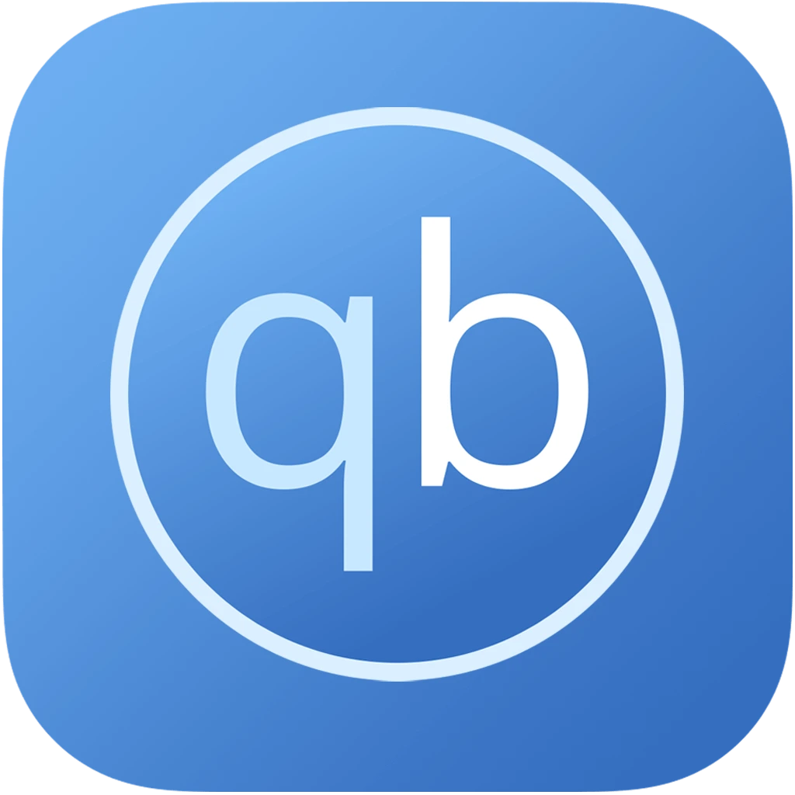

<h1>
ANI-RSS
</h1>

基于RSS自动追番、订阅、下载、刮削

<a href="start">快速开始</a>
|
<a href="add-rss">使用文档</a>
|
<a href="deploy/docker">Docker 部署</a>
|
<a href="faq">常见问题</a>
|
<a href="history">更新历史</a>
|
<a href="dev/basic">参与开发</a>

支持 <strong>Transmission</strong> <strong>qBittorrent</strong> <strong>Aria2</strong> <strong>OpenList</strong>

<!--@include: ./other.md{2,}-->
